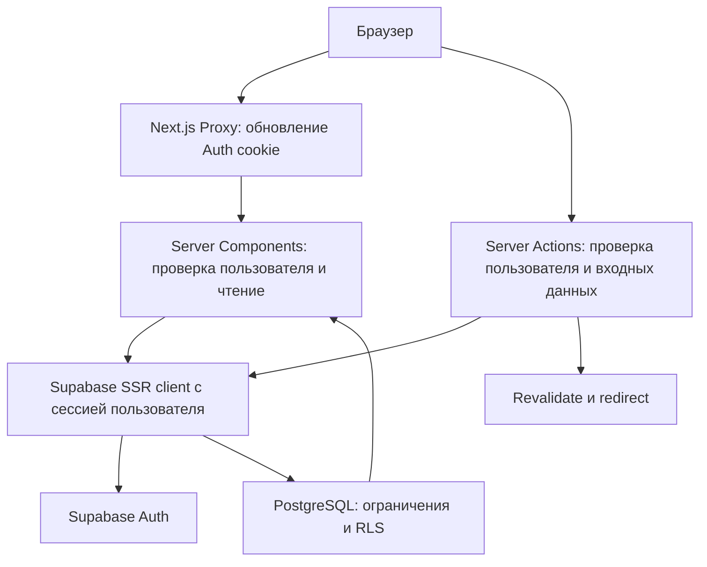
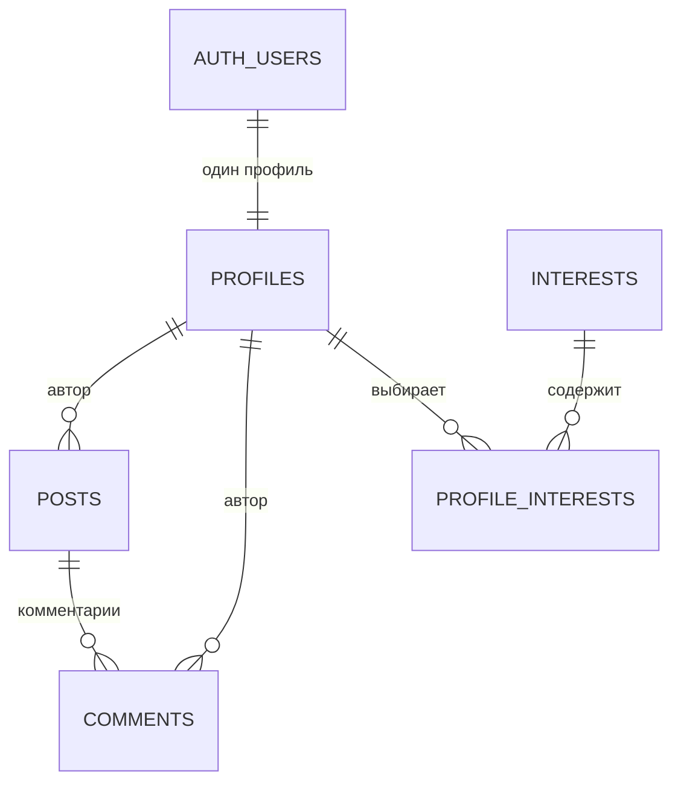

# Архитектура NEXUS

## Задача и границы

NEXUS — модульный монолит для социальной платформы одного колледжа. Next.js отвечает за интерфейс и серверную логику приложения. Supabase отвечает за идентификацию пользователей и PostgreSQL. Для MVP достаточно одного приложения и одной базы.

Переносимость означает, что весь исходный код, зависимости с lock-файлом, настройки-примеры, миграции и документация доступны в репозитории. Удалённое состояние Supabase хранится отдельно; его резервное копирование и перенос не заменяются копированием папки.

## Поток запроса

Браузер не выбирает `author_id` или владельца изменяемого профиля. Server Actions определяют пользователя по подтверждённой сессии, валидируют ввод и выполняют запрос от его имени. PostgreSQL повторно проверяет права через RLS. Ошибка или обход интерфейса не должны давать доступ к чужим записям.

## Структура

| Каталог / файл | Ответственность |
| --- | --- |
| `src/app/` | URL, layouts, страницы, маршруты Auth. Страницы собирают модули и обрабатывают навигацию. |
| `src/components/` | Общая оболочка, навигация, формы и визуальные примитивы без самостоятельных бизнес-правил. |
| `src/features/` | Формы, действия и запросы конкретных функций: авторизация, профили, публикации и комментарии. |
| `src/lib/supabase/` | Создание браузерного/серверного Supabase-клиента и работа с cookie. |
| `src/lib/` | Переиспользуемые валидаторы, форматирование и конфигурация. |
| `src/types/` | TypeScript-описание схемы PostgreSQL и общие типы. |
| `src/proxy.ts` | Обновление Auth-сессии на входящих запросах. |
| `supabase/migrations/` | История схемы, ограничений, функций, триггеров, RLS и начального каталога интересов. |
| `docs/` | Архитектура, план развития и проверка. |
| `public/` | Локальные статические ресурсы. |

Группы маршрутов в скобках служат организации файлов и не добавляют сегменты в URL. Серверные модули не импортируются в клиентские компоненты. Интерактивным формам достаточно небольших Client Components; состояние всей платформы не переносится в единый клиентский store.

## Маршруты

| URL | Назначение | Доступ |
| --- | --- | --- |
| `/` | Описание продукта и вход в приложение. | Всем. |
| `/login` | Вход по email/password. | Без сессии. |
| `/register` | Регистрация. | Без сессии. |
| `/setup` | Инструкция подключения Supabase. | Всем. |
| `/auth/confirm` | Проверка одноразового email token hash. | Обработчик подтверждения. |
| `/auth/callback` | Обмен PKCE-кода на сессию. | Обработчик подтверждения. |
| `/feed` | Хронологическая лента и создание публикации. | Вошедшим пользователям. |
| `/profile/[username]` | Профиль участника. | Вошедшим пользователям. |
| `/profile/edit` | Собственный профиль. | Владельцу. |
| `/posts/[id]` | Текст публикации и плоский список комментариев. | Вошедшим пользователям. |
| `/messages` | Заглушка сообщений. | Вошедшим пользователям. |
| `/map` | Заглушка карты. | Вошедшим пользователям. |
| `/ai` | Заглушка AI-помощника. | Вошедшим пользователям. |

При отсутствии настройки Supabase отображается понятная страница настройки. Она не подменяет базу демо-аккаунтами или локальным хранилищем.

## Схема данных

Основная миграция: `supabase/migrations/202609150001_core.sql`.

### `profiles`

Идентификатор профиля совпадает с UUID пользователя `auth.users`. Профиль содержит имя, фамилию, уникальный username, URL аватара, описание, специальность, курс, группу и время создания/обновления.

Профиль создаёт триггер при появлении нового пользователя Auth. Автоматический username имеет формат `u_` + UUID без дефисов; пользователь затем меняет его в настройках. Префикс с UUID защищён от присвоения чужого будущего username; значение `edit` зарезервировано для страницы редактирования. Сохранение профиля не зависит от ручного создания строки после первого входа.

Email и пароли не дублируются в `public.profiles`. Email доступен владельцу через Auth; остальные участники видят данные профиля. Поля проходят прикладную валидацию и ограничения базы. Внешняя HTTPS-ссылка на аватар — сознательное ограничение MVP; Storage пока не используется.

### `posts`

UUID публикации, ссылка на профиль автора, текст и временные метки. Лента читает записи в порядке от новых к старым, по 20 записей; номер страницы передаётся параметром `page`. Алгоритмического ранжирования и бесконечной прокрутки нет. Интерфейс MVP позволяет создать и открыть пост; отдельной формы редактирования или кнопки удаления поста пока нет.

### `comments`

UUID комментария, ссылка на публикацию, ссылка на профиль автора, текст и временные метки. Комментарии плоские, от новых к старым, по 30 записей на страницу. После отправки открывается первая страница с новым комментарием. Пользователь может удалить только собственный комментарий. На уровне БД удаление публикации удаляет связанные комментарии по внешнему ключу.

### `interests`

Справочник интересов: UUID, машинное обозначение и подпись. Начальный набор создаётся миграцией. Пользователь выбирает существующие элементы; произвольное создание новых тегов через клиентский API закрыто.

### `profile_interests`

Связь многие-ко-многим между профилями и интересами. Составной ключ предотвращает повторение одной пары, внешние ключи исключают несуществующий профиль или интерес. Такой формат позволяет позже искать людей по пересечению интересов без разбора текстовых списков.

Идентификаторы не задаются порядковыми числами. Временные метки хранятся с часовым поясом; отображение даты отделено от хранения. Ограничения текста, уникальности и допустимых значений определены в SQL, а интерфейс проверяет ввод раньше, чтобы объяснить ошибку пользователю.

Текущие ограничения: username — 3–40 строчных латинских букв, цифр или `_`; имя и фамилия — до 80 символов каждое; описание — до 300; специальность — до 120; группа — до 40; курс — от 1 до 6 либо не указан. Пост — до 5000 символов, комментарий — до 2000; текст из одних пробелов не допускается. Первичный источник этих правил — миграция, согласованная с валидаторами приложения.

## Сохранение профиля и интересов

Обновление полей профиля и полного выбранного набора интересов выполняется PostgreSQL RPC `update_my_profile` в одной транзакции. Функция принимает поля профиля и `p_interest_ids uuid[]`, убирает внешние пробелы и приводит username к нижнему регистру. При неизвестном интересе, повторе ID, `NULL` в списке, выборе более 10 интересов, конфликте username или нарушении ограничения откатывается всё изменение. Не возникает состояния «имя сохранено, интересы потеряны» из-за сбоя между несколькими HTTP-запросами.

RPC определяет целевой профиль по `auth.uid()`, а не доверяет переданному браузером UUID владельца. Вызов доступен авторизованной роли. Функция использует `SECURITY INVOKER`: выполняется с правами вызывающего пользователя и подчиняется RLS. Auth-триггер создания профиля имеет отдельные повышенные права и фиксированный `search_path`; его SQL и `GRANT/REVOKE` входят в обязательное ревью при изменении схемы.

## Auth и серверная сессия

Используется официальная библиотека `@supabase/ssr`. Supabase хранит и проверяет пароль; приложение получает сессию. Серверный клиент читает cookie из текущего запроса, клиентский компонент использует браузерный клиент при необходимости.

Proxy обновляет истекающие cookie. Он не является единственной границей доступа: защищённые страницы проверяют пользователя, а каждое изменяющее действие проверяет его повторно. Для решения о доступе нельзя полагаться только на непроверенное содержимое cookie или возвращаемую `getSession()` структуру.

В текущей реализации Proxy использует `getClaims()` для проверки токена и обновления сессии, а серверная проверка пользователя вызывает `getUser()` для актуальной проверки через Auth.

Подтверждение email поддерживает серверный `token_hash`-поток через `/auth/confirm` и обмен PKCE-кода через `/auth/callback`. Ссылки и redirect URLs настраиваются в Dashboard по README. После выхода сессия удаляется, закрытые страницы недоступны.

Публичный URL и publishable/anon key безопасны только при корректных политиках доступа. `service_role`, secret key и пароль PostgreSQL не используются приложением и не должны появляться в `NEXT_PUBLIC_*`.

## Правила доступа к данным

| Сущность | Чтение | Изменения |
| --- | --- | --- |
| `profiles` | Профили видны вошедшим участникам. | Только собственный профиль; создание связано с Auth-триггером. |
| `posts` | Публикации видны вошедшим участникам. | Создание от своего имени; изменение/удаление только своих записей в пределах SQL-политик. |
| `comments` | Комментарии видны вошедшим участникам. | Создание от своего имени; изменение/удаление только своих записей в пределах SQL-политик. |
| `interests` | Каталог доступен для выбора вошедшим участникам. | Изменяется миграциями, обычный пользователь не управляет каталогом. |
| `profile_interests` | Выбранные интересы видны вошедшим участникам. | Только связи собственного профиля. |

RLS включён на всех пяти таблицах. Дополнительные права на столбцы запрещают клиенту менять ID, владельца, временные метки и переносить комментарий на другую публикацию. Server Actions обеспечивают удобные ошибки и управление потоком, SQL обеспечивает инварианты независимо от интерфейса. Отсутствие кнопки в браузере не считается защитой. Редактирование постов/комментариев и удаление поста отдельными формами в MVP не заявлены; доступность операций в SQL и интерфейсе различается.

Текст постов, комментариев и описаний выводится как текст React. HTML из этих полей не исполняется. Redirect-параметры должны разрешать только безопасные внутренние пути.

## Обработка ошибок и обновление интерфейса

- Формы проверяют обязательность, длину и допустимость значений до записи.
- Server Actions возвращают понятные сообщения и не показывают технические секреты.
- После успешного изменения обновляются затронутые страницы через механизмы Next.js.
- Пустой список отличается от ошибки запроса.
- Неизвестный username или идентификатор публикации обрабатывается как отсутствие записи.
- Отсутствующая настройка Supabase имеет отдельное состояние.

## Почему приняты эти решения

| Решение | Причина |
| --- | --- |
| Next.js App Router | Маршруты, серверный рендеринг и обработка форм в одном приложении. |
| Server Components и небольшие клиентские формы | Меньше клиентского состояния и сетевых промежуточных слоёв. |
| Supabase Auth | Не нужно самостоятельно хранить пароли и реализовывать сессии. |
| PostgreSQL с RLS | Права и целостность проверяются рядом с данными. |
| Отдельный справочник интересов | Подходит для будущего поиска и подбора людей. |
| Атомарный RPC профиля | Поля и набор интересов сохраняются совместно или не сохраняются вовсе. |
| UUID и миграции | Стабильные связи, переносимая и проверяемая схема. |
| Обычная хронологическая лента | Предсказуемое поведение и ограниченный объём реализации. |
| HTTPS-ссылка аватара | Для первой версии не нужен дополнительный Storage и политики загрузки. |
| Страницы-заглушки | URL и навигация готовы; преждевременных таблиц и зависимостей нет. |

## Независимое развитие модулей

**Messages:** отдельные функции и таблицы диалогов, участников и сообщений. Сначала RLS членства в диалоге, затем UI, позже realtime и вложения. Публикации и комментарии не превращать в систему личных сообщений.

**College Map:** помещения, этажи и точки интереса с собственными идентификаторами. Начать с поиска и информации о кабинете; модель маршрутов добавлять после получения настоящих планов здания.

**NEXUS AI:** сначала курируемая база знаний колледжа с источниками и временем обновления. Внешние модели, секреты и обработка персональных данных требуют отдельного решения. Сейчас API модели и имитации ответов отсутствуют.

**Корпоративная почта:** ограничивать регистрацию на стороне Auth через поддерживаемую серверную проверку/политику допуска. Клиентская проверка домена может помогать пользователю, но не обеспечивает закрытый доступ в колледж.

## Правило миграций

1. Создать новый SQL-файл с упорядоченным именем.
2. Добавить таблицы/поля, индексы, ограничения и RLS в одном изменении.
3. Обновить типы базы и связанные серверные запросы.
4. Применить к отдельному тестовому проекту или тестовой базе.
5. Проверить права двух пользователей и анонимного клиента.
6. Документировать последствия для существующих данных.

Нельзя отключать RLS ради прохождения теста или использовать `service_role` в приложении для обхода ошибки доступа. Производственные данные не удаляются командой reset. Официальные материалы: [Next.js App Router](https://nextjs.org/docs/app), [Supabase SSR](https://supabase.com/docs/guides/auth/server-side/nextjs), [RLS](https://supabase.com/docs/guides/database/postgres/row-level-security).
